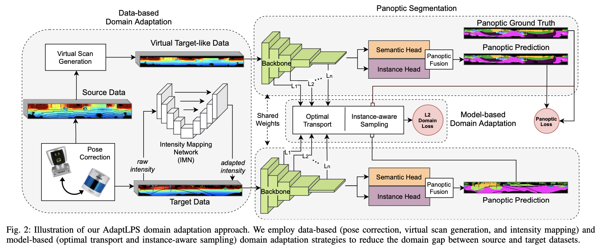
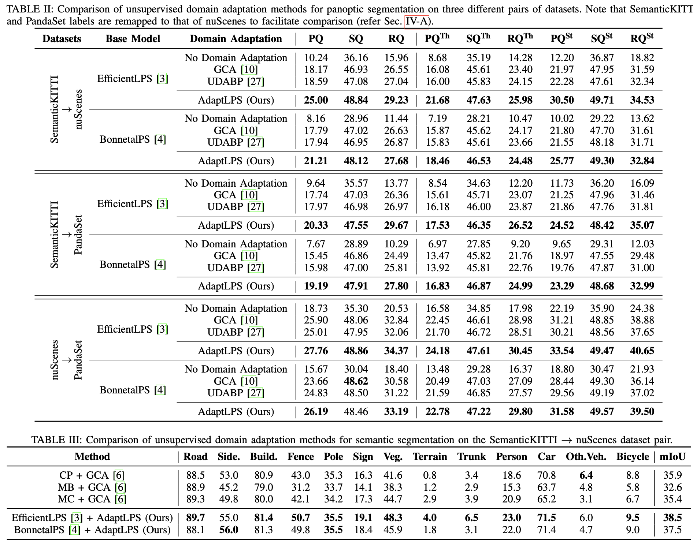

### AdaptLPS（arXiv）

> 论文标题：Unsupervised Domain Adaptation for LiDAR Panoptic Segmentation.          
> 论文地址：[https://arxiv.org/pdf/2104.02246.pdf](https://openaccess.thecvf.com/content/CVPR2021/papers/Liu_One_Thing_One_Click_A_Self-Training_Approach_for_Weakly_Supervised_CVPR_2021_paper.pdf).     
> 作者单位：暂无    
> 代码地址：暂无         
> 一句话读论文：They propose an unsupervised domain adaptation model named AdaptLPS, in order to  leverage task-specific knowledge and account for variation.

.  
网络框架. 

.   
实验结果    

模型使用两种策略来进行domain adaptation: 基于数据和基于模型.    

- **data-based**  基于数据的adaptations使用三种技术处理原始雷达点云数据，来减少source domain和target domain的差距：
>  The data-based domain adapta- tion minimizes the domain gap between the raw LiDAR scans from the source and target domains using three techniques, namely, (i) pose correction which accounts for the different mounting positions of LiDARs, (ii) virtual scan generation which simulates the point cloud from the target domain using the source domain, and (iii) intensity mapping which learns a residual to map the LiDAR intensities between the source and target domains.

- **model-based**  基于模型的adaptations应用Multi-scale Feature-space Optimal Transport (MS-FSOT)和Instance-Aware Sampling (IAS)两种方法来使网络在source domain和target domain上都能抓取到由代表性的特征。    

> MS-FSOT:
Optimal transport establishes a framework for comparing two probability measures and provides a solution for moving the mass from one distribution to the other.      
> IAS: 
We sample a fixed number of points, for each (class, instance) pair for alignment by MS- FSOT. Further, we downsample the panoptic labels to match the height and width of the feature map to associate every element in the feature map with its corresponding pair.
