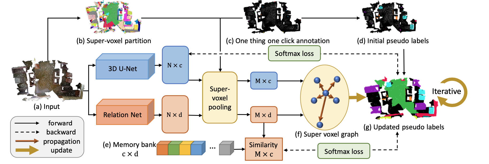
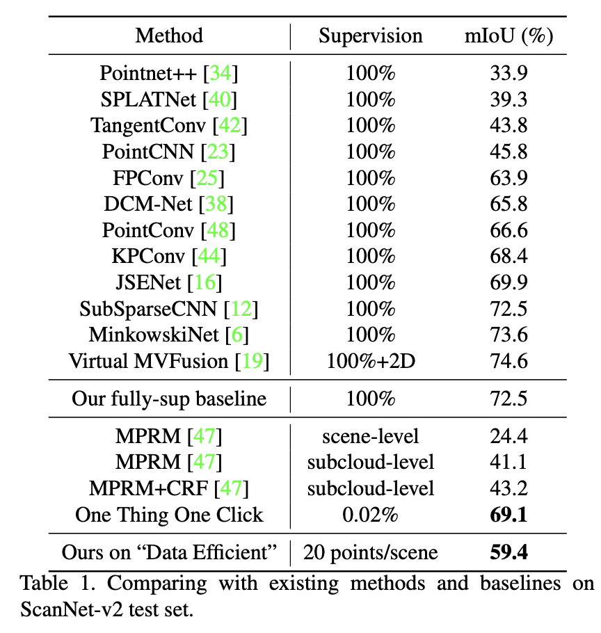
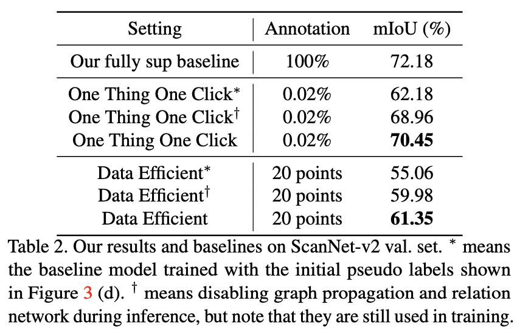
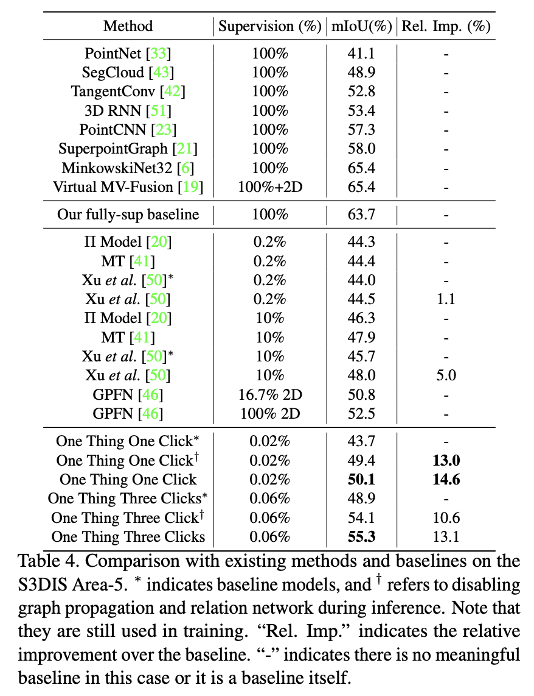

### One thing one click（CVPR 2021）

> 论文标题：One Thing One Click: A Self-Training Approach for Weakly Supervised 3D Semantic Segmentation.      
> 论文地址：[https://arxiv.org/pdf/2104.02246.pdf](https://openaccess.thecvf.com/content/CVPR2021/papers/Liu_One_Thing_One_Click_A_Self-Training_Approach_for_Weakly_Supervised_CVPR_2021_paper.pdf).     
> 作者单位：The Chinese University of Hong Kong, The University of Hong Kong.     
> 代码地址：[https://github.com/liuzhengzhe/One-Thing-One-Click].      
> 一句话读论文：They use a graph propagation module to iteratively conduct training and label propagation and a relation network to model the feature similarity among graph node.

.  
网络框架. 

.   
在ScanNet-v2测试集的实验结果    

.  
在ScanNet-v2验证集的实验结果.   

.  
在S3DIS Area-5的实验结果.  

模型使用3D U-Net作为backbone，主要的特点在于使用图传播和关系网络来实现对大规模稀疏点云数据的语义分割任务。

- **graph propagation**  在将点云分割为super-voxel后，使用迭代的图传播机制将稀疏的标签传播到各个super-voxel区域：
>  To propagate labels to unknown regions through the graph, we formulate it as an optimization problem that considers both
the network prediction and similarities among the super- voxels to achieve the global optimum with the energy func- tion below similar to Conditional Random Field (CRF).

- **relation network** 为了提升标签传播的性能，引入一个关系网络模型作为3D U-Net的补充，对每个super-voxel进行embedding，从而预测它们之间的相似性：

> It aims to predict a category-related embedding fj for each super-voxel vj as the similarity measurement. 
